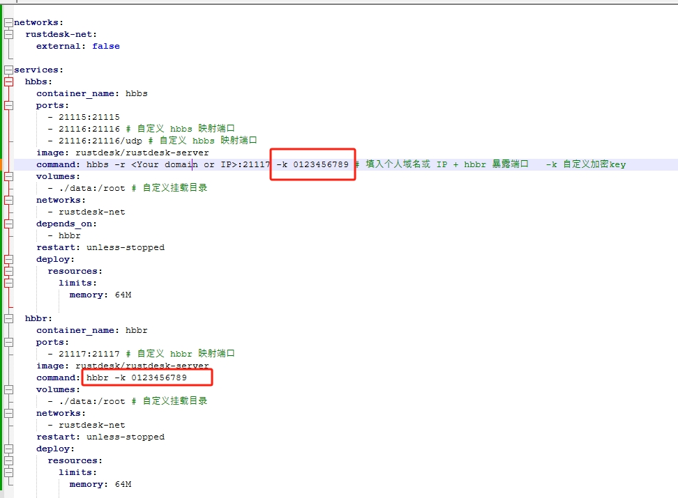
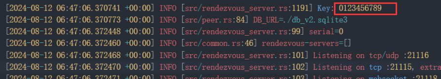
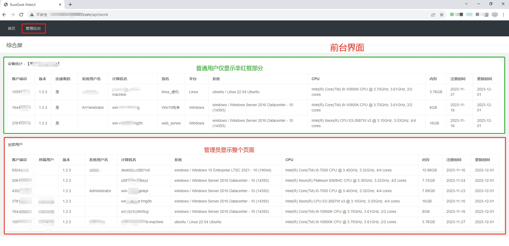
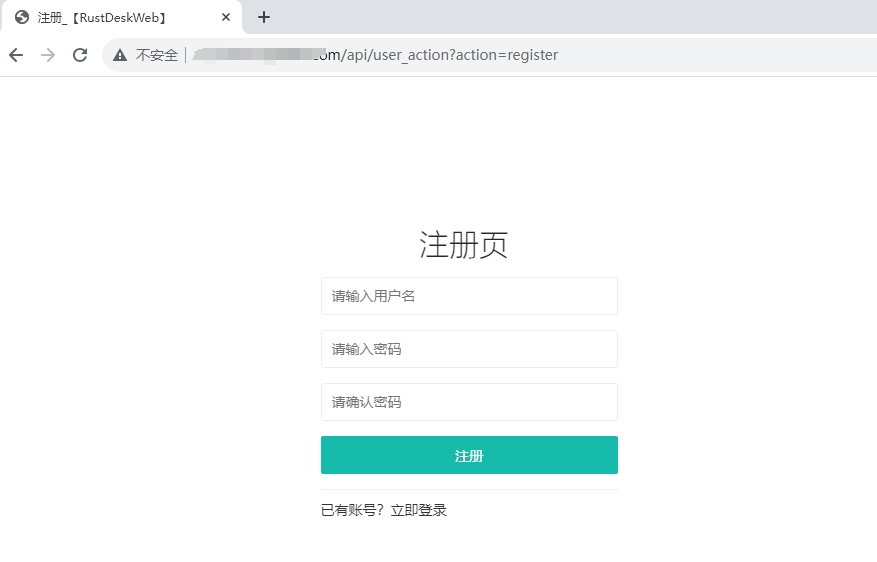
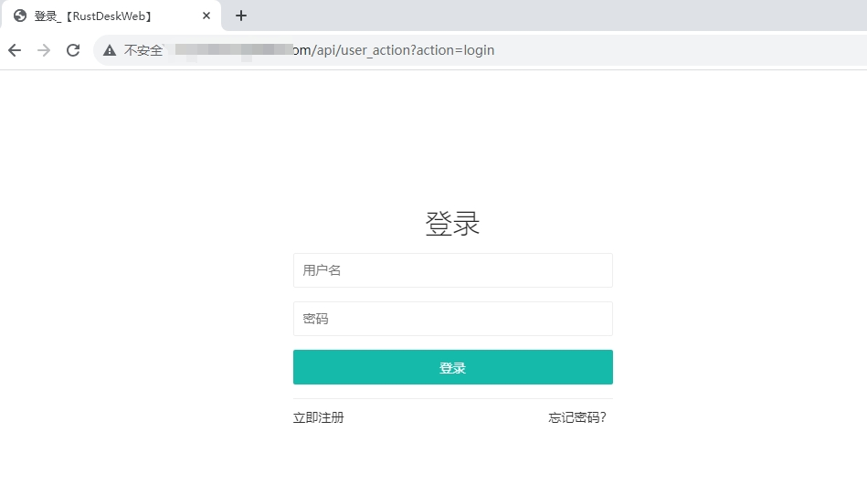
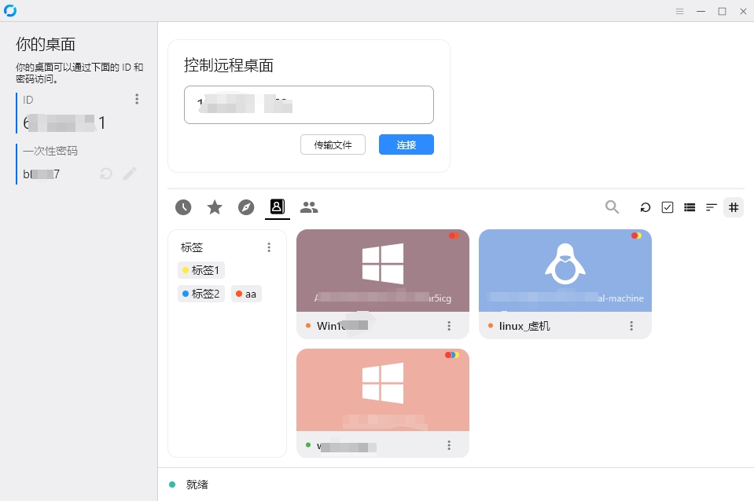
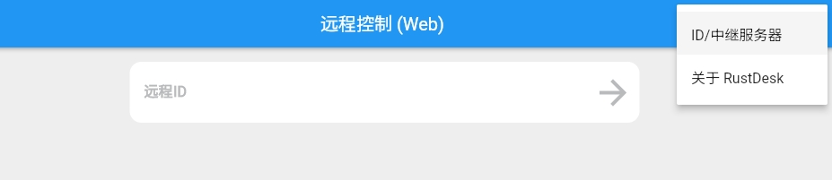
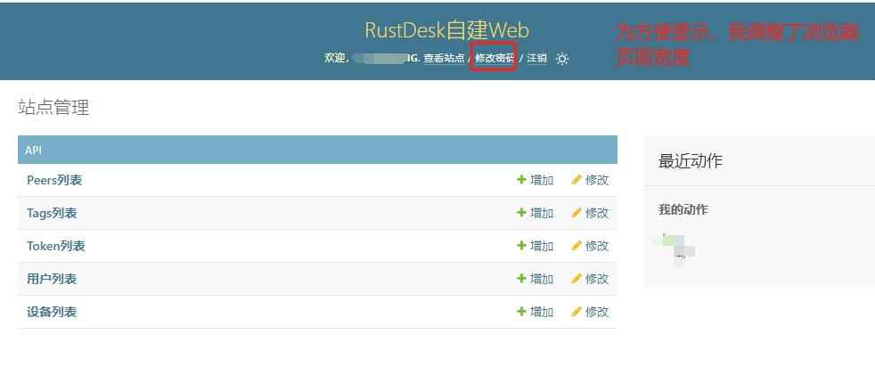

# rustdesk-api-server


[The English explanation is available by clicking here.](https://github.com/kingmo888/rustdesk-api-server/blob/master/README_EN.md)

<p align="center">
    <i>一个 python 实现的 Rustdesk API 接口，支持 WebUI 管理</i>
    <br/>
    
    
    
    <br/>
    
    
</p>

# 1.2.3版本与1.2.6+版本区别
#### **请使用自定义key，因不填写key、或使用服务端自动生成的key而引起的链接超时或建立链接时间过长的问题，不在本项目解决范围内。**


> rustdesk官方在其新版服务端中已[强制要求key](https://rustdesk.com/docs/zh-cn/self-host/rustdesk-server-oss/install/#key)(rustdesk-server版本号大概>=1.1.10)

- rustdesk版本<=1.2.3, 服务端请配合使用rustdesk-server<=1.1.10
  - 根据自身需要来选择是否配置服务端的key参数。
- rustdesk版本>1.2.3, 服务端请配合使用rustdesk-server>=1.1.11
  - 当使用rustdesk-server自动生成的key时，会出现链接缓慢甚至链接超时。
  - 解决办法：使用自定义k——配置rustdesk-server时，传入k参数来自定义key值，同时客户端同步配置相同的key，即可秒连。

  - rustdesk-server的dock-compose配置参考：

  

`key是保证别人不能在知道你中继服务器的IP后，利用你的IP做中继。如果不配置key，就做好中继IP的保密工作，不要泄露给其他人。
而只要服务端配置了密钥，无论是随机生成（生成后本身就固定了），还是自定义的，如果控制客户端不配置对应key就无法控制其他机器（被控机器可以不填key）`

对于自定义key是否生效，请看rustdesk server中`hbbs`的日志：


## 展示



## 功能特点

- 支持前台网页自主注册和登录。
  - 注册页与登录页：
  
  

- 支持前台展示设备信息，分为管理员版、用户版。
- 支持自定义别名（备注）。
- 支持后台管理。
- 支持彩色标签。


- 支持设备在线统计。
- 支持设备密码保存。
- 利用心跳接口自动管理token并保活。
- 支持分享设备给其他用户。

- 支持web控制端（目前仅支持非SSL模式，见下面使用问题说明）


后台主页：


## 安装

### 方法1：开箱即用

仅支持Windows，请前往 release 下载，无需安装环境，直接运行`启动.bat`即可。 截图：


### 方法2：代码运行

```bash
# 将代码克隆到本地
git clone https://github.com/kingmo888/rustdesk-api-server.git
# 进入目录
cd rustdesk-api-server
# 安装依赖
pip install -r requirements.txt
# 确保依赖安装正确后，执行：
# 端口号请自行修改，建议保留21114为Rustdesk API默认端口
python manage.py runserver 0.0.0.0:21114
```

此时即可使用 `http://本机IP:端口` 的形式来访问。

**注意**：如果 CentOS 配置时，Django4 会因为系统的 sqlite3 版本过低而出问题，请修改依赖库中的文件。路径：`xxxx/Lib/site-packages/django/db/backends/sqlite3/base.py` （根据情况自行查找包所在地址），修改内容:
```python
# from sqlite3 import dbapi2 as Database   #(注释掉这行)
from pysqlite3 import dbapi2 as Database # 启用pysqlite3
```

### 方法3：Docker 运行

#### Docker方法1：自行构建
```bash
git clone https://github.com/kingmo888/rustdesk-api-server.git
cd rustdesk-api-server
docker compose --compatibility up --build -d
```
感谢热心网友 @ferocknew 提供。

#### Docker方法2：预构建运行

docker run 命令：

```bash
docker run -d \
  --name rustdesk-api-server \
  -p 21114:21114 \
  -e CSRF_TRUSTED_ORIGINS=http://yourdomain.com:21114 \ #防跨域信任来源，可选
  -e ID_SERVER=yourdomain.com \ #Web控制端使用的ID服务器
  -v /yourpath/db:/rustdesk-api-server/db \ #修改/yourpath/db为你宿主机数据库挂载目录
  -v /etc/timezone:/etc/timezone:ro \
  -v /etc/localtime:/etc/localtime:ro \
  --network bridge \
  --restart unless-stopped \
  ghcr.io/kingmo888/rustdesk-api-server:latest
```

docker-compose 方式：

```yaml
version: "3.8"
services:
  rustdesk-api-server:
    container_name: rustdesk-api-server
    image: ghcr.io/kingmo888/rustdesk-api-server:latest
    environment:
      - CSRF_TRUSTED_ORIGINS=http://yourdomain.com:21114 #防跨域信任来源，可选
      - ID_SERVER=yourdomain.com #Web控制端使用的ID服务器
    volumes:
      - /yourpath/db:/rustdesk-api-server/db #修改/yourpath/db为你宿主机数据库挂载目录
      - /etc/timezone:/etc/timezone:ro
      - /etc/localtime:/etc/localtime:ro
    network_mode: bridge
    ports:
      - "21114:21114"
    restart: unless-stopped
```

## 环境变量

| 变量名 | 参考值 | 备注 |
| ---- | ------- | ----------- |
| `HOST` | 默认 `0.0.0.0` | 绑定服务的IP |
| `TZ` | 默认 `Asia/Shanghai`，可选 | 时区 |
| `SECRET_KEY` | 可选，自定义一串随机字符 | 程序加密秘钥 |
| `CSRF_TRUSTED_ORIGINS` | 可选，默认关闭验证；<br>如需开启填写你的访问地址 `http://yourdomain.com:21114` <br>**如需关闭验证请删除此变量，而不是留空** | 防跨域信任来源 |
| `ID_SERVER` | 可选，默认为和API服务器同主机。<br>可自定义如 `yourdomain.com` | Web控制端使用的ID服务器 |
| `DEBUG` | 可选，默认 `False` | 调试模式 |
| `ALLOW_REGISTRATION` | 可选，默认 `True` | 是否允许新用户注册 |
| 数据库配置 | -- 开始 -- | 若不使用MYSQL则以下皆无需配置 |
| `DATABASE_TYPE` | 可选，默认 `SQLITE3` | 数据库类型(SQLITE/MYSQL) |
| `MYSQL_DBNAME` | 可选，默认 `-` | MYSQL数据库名 |
| `MYSQL_HOST` | 可选，默认 `127.0.0.1` | MYSQL数据库的服务器IP |
| `MYSQL_USER` | 可选，默认 `-` | MYSQL数据库的用户名 |
| `MYSQL_PASSWORD` | 可选，默认 `-` | MYSQL数据库的密码 |
| `MYSQL_PORT` | 可选，默认 `3306` | MYSQL数据库端口 |
| 数据库配置 | -- 结束 -- | 查看【[sqlite3迁移mysql教程](/tutorial/sqlite2mysql.md)】 |
| `LANGUAGE_CODE` | 可选，默认 `zh-hans` | 语言，支持中文(`zh-hans`)、英语(`en`) |

## 使用问题

- 管理员设置

  当数据库中不存在账户时，第一个注册的账户直接获取超级管理员权限，之后注册账户为普通账户。

- 设备信息

  经测试，客户端会在非绿色版模式下，安装为服务的模式中，定时发送设备信息到api接口，所以如果想要设备信息，需要安装rustdesk客户端并启动服务。

- 连接速度慢

  新版本Key模式链接速度慢，可以在服务端启动服务时，不要带参数的-k，此时，客户端也不能配置key。

- Web控制端配置

  - 设置ID_SERVER环境变量，或修改rustdesk_server_api/settings.py文件中ID_SERVER配置项，将ID服务器/中继服务器IP或域名填上。

- Web控制端一直转圈

  - 检查ID服务器填写是否正确

  - Web控制端目前仅支持非SSL模式，若webui为https访问，请将s去掉，否则ws连不上一直转圈。如：https://domain.com/webui，改为http://domain.com/webui

- 后台操作登录或登出时：CSRF验证失败. 请求被中断.

  这种操作大概率是docker配置+nginx反代+SSL的组合，要注意修改CSRF_TRUSTED_ORIGINS，如果是ssl那就是https开头，否则就是http。

- Mysql版本要求

  如果你使用的是Mysql数据库，需要注意django4.x版本需要Mysql8.0，如果要使用mysql5.8则需要将django版本降至3.2。

## 开发计划

- [x] 分享设备给其他已注册用户（v1.3+）

  > 说明：类似网盘url分享，url激活后可以获得某个或某组或某个标签下的设备
  > 备注：其实web api作为中间件，可做的不多，更多功能还是需要修改客户端来实现，就不太值当了。

- [x] 集成Web客户端形式（v1.4+）

  > 将大神的web客户端集成进来，已集成。 [来源](https://www.52pojie.cn/thread-1708319-1-1.html)

- [x] 对过期（不在线）设备的过滤，用以区分在线&离线设备(1.4.7)

  > 通过配置方式，对过期超过指定时间的设备清理或过滤。

- [x] 首屏拆分为用户列表页与管理员列表页并增加分页(1.4.6)。

- [x] 支持信息导出到为xlsx文件(1.4.6)。

  > 支持管理员在【所有设备】页面导出所有设备信息。

- [x] 通过配置项设定是否允许新用户注册(1.4.7)。

- [x] 支持mysql及sqlite3迁移mysql(1.4.8)。

- [-] 用户前端修改密码。

- [-] 前端改造，所有页面自适应，前后端分离(计划V2)。


## 其他相关工具

- [可以修改客户端ID的CMD脚本](https://github.com/abdullah-erturk/RustDesk-ID-Changer)

- [rustdesk](https://github.com/rustdesk/rustdesk)

- [rustdesk-server](https://github.com/rustdesk/rustdesk-server)

## Stargazers over time
[](https://starchart.cc/kingmo888/rustdesk-api-server)


## 联络我

